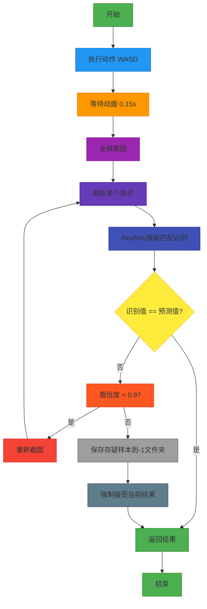
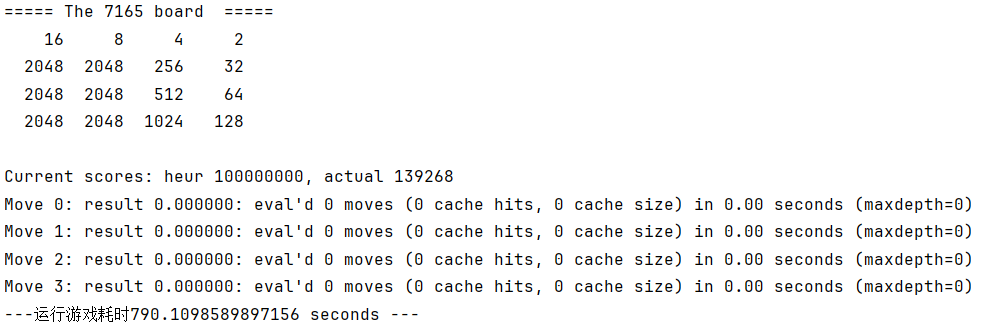

# 🎮《原神》2048 AI 自动化系统 README

> ✅ 作者：Augenstern  
> ✅ 版本：v1.0（原始版本）  
> ✅ 最后更新：2025-10-18  
> ✅ 核心目标：全自动通关《原神》网页小游戏「合成丘丘王」—— 7165步极限挑战！
>
> 🤝**改编自[nneonneo/2048-ai](https://github.com/nneonneo/2048-ai)**

## 🏆 项目亮点速览（TL;DR）

| 类别           | 说明                                                         |
| -------------- | ------------------------------------------------------------ |
| ⚡ **速度极限** | 理论最优解仅需 **7165步**，AI运行耗时约 **13分钟**（C++无图像识别） |
| 🧠 **智能决策** | 改进Expectimax + 动态深度剪枝 + 2048防移动策略 + 完美终局检测 |
| 🖼️ **图像识别** | 双引擎支持（ResNet/模板匹配），独创 `get_ocr_list()` 极速预测机制 |
| 💡 **OCR优化**  | 三种模式可选：<br>• `all` 全盘扫描 → 稳<br>• `prob` 预测验证 → 快+准<br>• `new` 仅扫新生 → 极速但高危 |
| 📹 **全程记录** | 自动截图+可视化+视频合成，每一步都可追溯复盘                 |
| 🛠️ **开箱即用** | 提供 Windows DLL/EXE，无需编译烦恼                           |

---

## 📂 目录结构

```markdown
genshin2048-ai/
├── 📜 ailib.py                 # Python ↔ C++ 桥接层（封装2048.dll/.so）
├── 📜 2048.cpp                 # 核心AI引擎（位运算优化+原神规则定制）
├── 📜 genshin2048.py           # 纯Python模拟器（调试/离线测试用）
├── 📜 auto_ys.py               # 主控脚本（图像识别+动作执行+流程调度）
├── 📜 resnet_infer.py          # ResNet34推理模块（支持.pth模型加载）
├── 📜 train_resnet34.py        # 模型训练脚本（带数据增强）
├── 📜 make_mp4.py              # 截图 → MP4 视频合成器
│
├── 📁 bin/                     # 【必需】动态库 & 可执行文件（Win提供参考）
│   ├── 🆗 2048.dll             # Windows（已提供）
│   ├── 🆗 2048.exe             # Windows可执行版（调试用）
│   ├── 🚧 2048.so              # Linux（需自行编译）
│   └── 🚧 2048.dylib           # MacOS（需自行编译）
│
├── 📁 models/                  # 预训练模型（推荐使用）
│   └── 🆗resnet34_filtered_max_2048.pth
│
├── 📁 templates/               # 数字模板（手动截图最佳！）
│   └── 🟢 0/, 2/, ..., 2048/   # 模板
│
├── 📁 dataset/                 # 训练数据集（按类别组织）
│   └── 🟡0/, 2/, ..., 2048/
│
├── 📁 game*/                   # 自动生成的游戏记录（move_X.png）
└── 📜 README.md                # 本文件（你正在阅读的终极指南）
```

> 🔶 注：带 🚧 的文件需用户自行编译；带 🆗 的文件已提供；带 🟡 的文件建议定期清理。

---

## 🧩 技术架构详解

### 1. AI决策引擎：为“原神规则”量身定制的 Expectimax++

#### 🎯 核心改进：

✅ **条件裁枝取代概率裁枝**  
 → 原版依赖“90%生成2”的概率模型，但在原神中**只生成2**，故概率模型失效。  
 → 新策略：对**无效移动** & **导致2048被移动的行为** 直接剪枝！

✅ **2048冻结策略**  
 → 2048一旦移动 → 占用自由度 → 无法完成终局 → **必须卡死不动！**

✅ **完美终局检测（Perfect Endgame）**  
 → 条件：6×2048 + {2,4,...,1024}全存在 → 返回 `100,000,000` 分强制胜出！

✅ **棋盘编码：天生为位运算而生**  
 → 16格 × 4bit = 64bit整数 → 移位、掩码、异或操作飞快

✅ **启发式函数（Heuristic Score）**  
 - 空格奖励（`SCORE_EMPTY_WEIGHT * empty`）  
 - 合并潜力（`SCORE_MERGES_WEIGHT * merges`）  
 - 单调惩罚（`min(左单调, 右单调) * WEIGHT`）  
 - 总和惩罚（防止贪大数字）  
 - 输局重罚（`SCORE_LOST_PENALTY`）

✅ **动态搜索深度**  
 → `depth_limit = max(3, distinct_tiles - 2)`  
 → 后期盘面复杂 → 深度增加 → 保证终局成功率

> 💬 作者注：搜索深度公式是“试出来的”，欢迎数学大佬推导理论最优值！

---

### 2. 图像识别引擎：极速 + 高准双模式

#### 🔄 识别流程图



#### 🚀 模式对比表（实测性能）

| 模式组合            | 平均耗时 | 推荐场景               | 备注                           |
| ------------------- | -------- | ---------------------- | ------------------------------ |
| `Template + all`    | 370ms    | 不推荐                 | 192次匹配太慢                  |
| `ResNet + all`      | 150ms    | **通用首选**           | 泛化强，稳定                   |
| `Template + prob`   | 100ms    | **最推荐（平衡之选）** | 准确+快速+可纠错               |
| `Template + new`    | 50ms     | 设备极慢 / 动画延迟高  | ⚠️ 无容错，一步错步步错         |
| `ResNet + prob/new` | 150ms    | 不推荐                 | ResNet泛化过强，易在动画中误判 |

> 💡 **关键设计：`get_ocr_list()` 函数**  
> 利用游戏规则预测下一状态，极大减少匹配次数：
>
> - `new`模式：初期最多匹配4格，后期常只需1格
> - `prob`模式：仅匹配“合理候选值”，如某格预测是2，则只匹配{0,2}

---

### 3. 自动化控制模块

- 使用 `keyboard` 模拟 WASD（比 `pyautogui.press` 更稳定）
- 支持手动设置坐标 `locate_game_region_manual(x,y)`
- 默认适配 **2K分辨率（2560×1440）**，1K用户需自行调整

---

### 4. 数据记录与可视化

- 自动生成 `gameN/move_X.png`，包含：
  - 左侧：原始游戏画面
  - 右侧：AI识别矩阵（数字+边框）
  - 底部：步数、动作、时间戳
- 支持按间隔保存（`save_move_interval=5` 可每5步存一次）

---

### 5. 训练系统（ResNet34）

- 支持从 `dataset/` 加载自定义数据
- 数据增强：随机裁剪、旋转、颜色抖动、翻转
- 自动保存最高准确率模型 + 类别映射表
- 模型兼容性：支持旧版state_dict 和 新版checkpoint格式

---

## 结果示例：

### 1⃣️Python（genshin2048.py）调用C++（动态库2048.Dll）

#### 大约790s（win11任务管理器，任务调度为实时）



### 2⃣️完美终局

#### 大约需要1h(其中每步动画约0.35s，识别0.05s，AI决策约800s，（0.35+0.05）*7165+800=3666s)


## 🛠️ 安装与配置

### 步骤1：安装依赖

```bash
pip install torch torchvision opencv-python pillow numpy keyboard pyautogui tqdm
```

> 💡 若GPU可用，强烈建议安装CUDA版本PyTorch以加速ResNet推理！

### 步骤2：放置二进制文件（Windows用户跳过编译）

确保以下文件存在：

```
bin/
├── 2048.dll     ← Windows用户必备
├── 2048.exe     ← 可选调试用
└── (Linux/Mac用户需自行编译2048.so/.dylib)
```

> ❗ 编译提示：使用 Visual Studio → Release x64 → 生成DLL。不会编译？用作者提供的dll！

### 步骤3：下载或训练模型

```bash
mkdir models
# 下载预训练模型 models/resnet34_filtered_max_2048.pth
```

或自己训练：

```bash
python train_resnet34.py
```

---

## ▶️ 运行主程序

编辑 `auto_ys.py` 末尾：

```python
if __name__ == "__main__":
    automator = H52048Automation()
    
    # ========== 核心配置 ==========
    automator.pic_recognize_mode = "Template"  # 推荐Template
    automator.ocr_mode = "prob"               # 推荐prob（平衡模式）
    
    # ========== 辅助功能 ==========
    automator.save_train_data = False         # 开启可积累训练数据
    automator.save_board = True               # 保存每一步截图
    automator.save_move_interval = 1          # 每步都保存
    
    # ========== 坐标设置（2K屏默认值）==========
    # automator.locate_game_region_manual(x=490, y=400)
    
    automator.run()
```

然后运行：

```bash
python auto_ys.py
```

---

## 🎬 视频合成（一键生成回顾视频）

```bash
python make_mp4.py
```

输出：`output.mp4`（120fps高清流畅播放）

> ✅ 小贴士：删除不需要的 `move_X.png` 可缩短视频长度！

---

## 🎯 原神专属规则支持

| 游戏机制     | 本AI实现方式                                  |
| ------------ | --------------------------------------------- |
| 新块生成位置 | 移动方向对面边缘（上→下，左→右）              |
| 2048禁止合并 | 代码中限制 rank < 11（2^11=2048）             |
| 仅生成数字2  | `draw_tile()` 永远返回1（对应rank=1 → 数字2） |
| 完美终局检测 | 6×2048 + 2~1024齐全 → 返回1亿分强制胜利       |

---

## 🛠️ 调试技巧

### 1. 快速定位游戏区域

```python
automator.debug_screenshot("定位测试")  # 生成截图辅助找坐标
```

### 2. C++端单步调试

取消 `2048.cpp` 中注释：

```cpp
// int main() {
//     init_tables();
//     debug_solve_one_step(); // ← 取消这行注释
//     return 0;
// }
```

可手动输入16个数字测试AI建议。

### 3. 查看AI搜索日志

终端实时输出：

```
Move 2: result 12345.67: eval'd 1234 moves (56 cache hits) in 0.12s (maxdepth=5)
```

---

## 💡 未来优化方向（欢迎PR！）

- [ ] GUI图形界面（PyQt/Tkinter）
- [ ] 搜索深度公式理论推导（空间复杂度/自由度分析）
- [ ] 时间裁枝（单步超时自动降深）
- [ ] 动画播放时间用于预测动作

---

## 📜 开源协议

```
MIT License

Copyright (c) 2025 Augenstern

Permission is hereby granted, free of charge, to any person obtaining a copy
of this software and associated documentation files (the "Software"), to deal
in the Software without restriction...
```

---

## 📬 联系作者

📬 邮箱：2949579524@qq.com  
💬 欢迎交流技术细节、提交Issue或PR！

---

> 🌟 **祝你在提瓦特的数字征途上——所向披靡，六核归一，登顶终局！**  
> 🕹️ 7165步不是极限，而是新的起点！

---

**📌 文档版本：v1.0（原始版本）**  
**📆 更新日期：2025年10月18日**  
**🧑‍💻 由 Augenstern 倾情打造，AI助手协助优化**